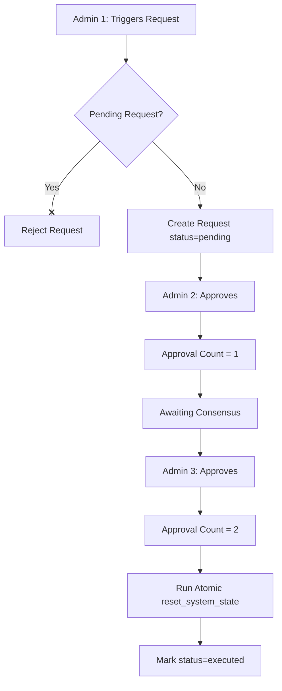

# Governed System State Reset (Multi-Admin Approval Workflow)

This document describes the design, scope, and technical implementation of the destructive state-reset protocol in the Nexus platform.

## 1. Governance & Multi-Admin Consensus

Destructive operations that wipe platform data are gated by a multi-admin consensus workflow. This prevents a single compromised or rogue admin account from executing a catastrophic state wipe.

### Invariants
*   **Three-Admin Minimum**: The system requires at least 3 active admins to ever execute a reset.
*   **No Self-Approval**: The admin who initiates (triggers) the request cannot approve it.
*   **No Duplicate Approvals**: An approving admin can only approve a request once.
*   **Single Active Request**: Only one pending reset request may exist at any time. Any new trigger attempt is rejected if a pending request is already active.
*   **Auto-Execution**: The system wipe executes automatically inside the transaction of the 2nd approval.



---

## 2. Reset Scope Contract

The system distinguishes between **dynamic transactional state** (wiped) and **structural config/identity catalog assets** (preserved).

| Table | Reset Behavior | Rationale / Relationship |
| :--- | :--- | :--- |
| `tasks` | **Wiped** | Cascade-deletes all participations and submissions. References `task_categories` (preserved) with `ON DELETE RESTRICT`. |
| `task_participations` | **Wiped** | Cascade-deleted. |
| `task_submissions` | **Wiped** | Cascade-deleted. Audit details (`reviewed_by`, `reviewed_at`) are wiped automatically with submission rows. |
| `point_transactions` | **Wiped** | Purged explicitly (FK `ON DELETE SET NULL` on participations doesn't wipe them). |
| `profiles.points` | **Zeroed** | The cached points column on profiles must be updated to `0`. |
| `teams` | **Wiped** | Cascade-deletes all team memberships. |
| `team_members` | **Wiped** | Cascade-deleted. |
| `reward_claims` | **Wiped** | Merit redemption logs are cleared. |
| `category_cap_resets` | **Wiped** | Category manual point cap reset logs are cleared. |
| `profiles` / `auth.users` | **Preserved** | User credentials, profiles, status, and role assignments survive. |
| `rewards` | **Preserved** | The rewards catalog remains intact. |
| `task_categories` | **Preserved** | The categories catalog remains intact (similar to rewards catalog). |
| `app_configurations` | **Preserved** | Operational parameters (multipliers, limits) survive. |
| `role_point_configs` | **Preserved** | Points configurations survive. |
| `system_reset_requests` | **Preserved** | Audit trail of reset requests survives resets. |
| `system_reset_approvals` | **Preserved** | Audit trail of approvals survives resets. |

---

## 3. Database Implementation & Gotchas

All database interactions run server-side. The database schema and security-definer RPCs enforce the protocol rules at the database level.

### Execution Primitive (`reset_system_state`)
The reset is performed atomically via a single Postgres transaction:
```sql
TRUNCATE TABLE 
  public.point_transactions,
  public.reward_claims,
  public.task_submissions,
  public.task_participations,
  public.tasks,
  public.team_members,
  public.teams,
  public.category_cap_resets
  RESTART IDENTITY CASCADE;
```

> [!WARNING]
> **Gotcha: Row-Level Triggers & TRUNCATE**
> The points synchronization trigger (`sync_profile_points`) is defined at the row level. A `TRUNCATE` statement does **not** fire row-level triggers. Consequently, the points cache in `profiles.points` is not automatically updated by truncating `point_transactions`.
> 
> **Solution**: The database primitive must explicitly execute:
> `UPDATE public.profiles SET points = 0;`
> immediately following the truncation.

### Security Definer Constraints
*   All workflow functions (`request_system_reset`, `approve_system_reset`, `cancel_system_reset`) are declared `SECURITY DEFINER` and internally query `is_admin()`.
*   To prevent bypasses, the primitive `reset_system_state()` has its `EXECUTE` privilege revoked from `PUBLIC` and is only granted to `service_role`. Clients can never execute the wipe directly; they must interact via `approve_system_reset()`.

---

## 4. Defense-In-Depth Security Architecture

Authorization is verified at three independent layers:

1.  **Route & Page Layer**: `/admin/danger-zone` is a server-side route that checks `isAdmin()` and performs a `redirect("/dashboard")` for non-admins. The navigation links are conditionally rendered.
2.  **Server Actions Layer**: Every action in [admin-reset.ts](file:///Users/hydrokat/Projects/hackthenorth/task-tracker/task-tracker-web/app-src/lib/actions/admin-reset.ts) verifies `isAdmin()` before calling Supabase.
3.  **Database Layer**: Every SQL function evaluates `is_admin()` based on the verified auth uid context.

### Confirmation Gate
The UI implements a destructive action confirmation gate requiring the admin to explicitly type the confirmation phrase `RESET` in a confirmation dialog. The execution request is transmitted via a standard POST-based Server Action (protected by built-in CSRF defenses in Next.js).

---

## 5. Schema Change Checklist & Gotchas (Post-Phase 016/018)

When modifying the database schema, future database developers must consult this checklist to prevent breaking the system state reset:

### 1. Identify Target Tables
*   Any new table that holds **dynamic operational state** (e.g. user records, logs, transactions, transactional configurations) **MUST** be added to the `TRUNCATE` list in the `reset_system_state()` RPC function.
*   Any table that holds **structural configuration/catalog data** (e.g., rewards, task categories) should **NOT** be truncated.

### 2. Foreign Key Topology Warnings
*   **ON DELETE RESTRICT Warning**: If a truncated table (like `tasks`) contains a foreign key pointing to a preserved catalog table (like `task_categories`) with `ON DELETE RESTRICT`, it will **not** block `TRUNCATE` of the referencing table. PostgreSQL allows truncating child tables (referencing side) directly.
*   **ON DELETE RESTRICT Parent Block**: However, if a preserved table (like `task_categories`) has an `ON DELETE RESTRICT` constraint pointing to it, and you run a migration that depends on cascade actions, ensure the order of table truncation is correct.
*   **Wiped Table FKs**: Any new table that references a truncated table must either be truncated alongside it (e.g., `category_cap_resets` referencing `task_categories` and `profiles` should be explicitly truncated) or must use `ON DELETE CASCADE` / `ON DELETE SET NULL` as appropriate.

### 3. Verification Protocol
*   After any schema migration touching active tables, verify the reset protocol locally or on a staging database by running the `reset_system_state()` RPC.
*   Ensure that the server-side action (`approveSystemReset`) allowlist is kept in sync or has robust structured logging so unexpected database errors are surfaced cleanly for developer triage.

### Case Study: Phase 018 Migration
During Phase 016 (Submission Vouching), two new schemas broke the reset:
1.  `category_cap_resets` was introduced as transactional state, but was not in the `TRUNCATE` list.
2.  `tasks.category_id` was added pointing to `task_categories` with `ON DELETE RESTRICT`. While this is safe for child table truncation, the mismatch between UI scope contracts and database behavior led to errors.
In Phase 018, `category_cap_resets` was explicitly added to the truncate list, and the server action fallback error logging was hardened using `actionError` to log the full Postgres error fields (`code`, `message`, `details`, `hint`) to prevent future diagnostics blindspots.
