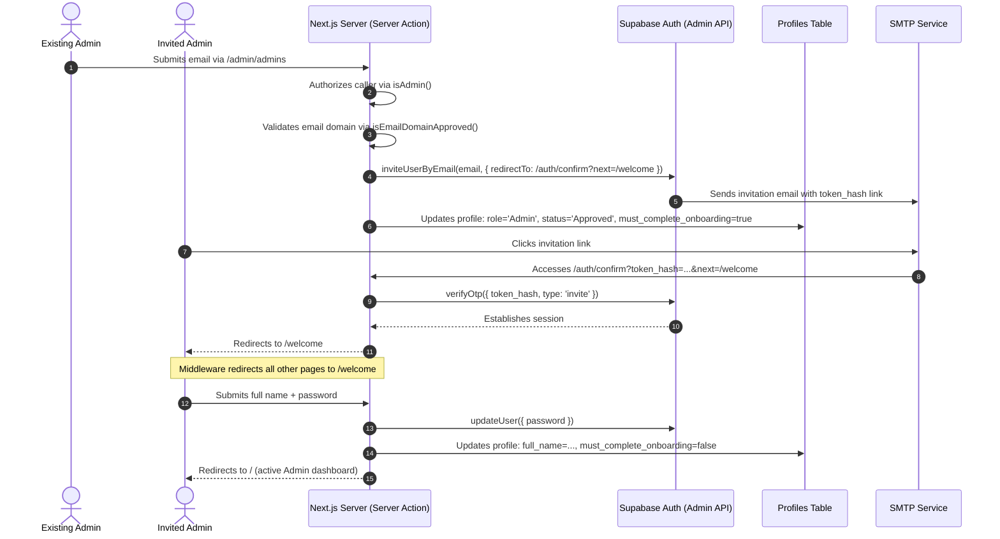

# Admin Invitation & Onboarding Guidelines

This document outlines the architectural pattern and implementation details for inviting new administrators to the Nexus system and guiding them through a secure, first-time login onboarding process.

---

## Onboarding Architecture

The onboarding workflow ensures that invited administrators establish their own names and high-entropy passwords before obtaining access to administrative tools.

---

## Onboarding Flag Gating vs. Password Reset

The system maintains two distinct flows for first-time login credentials to avoid conflicts and state collisions:

| Feature / Property | `must_reset_password` | `must_complete_onboarding` |
|---|---|---|
| **Intended User** | Standard team members imported/added by admins. | Invited administrators. |
| **Gated Information** | **Password only** (credentials generated client-side by admin first). | **Full Name AND Password** (credentials not generated by admin). |
| **Gating Page** | `/reset-password` | `/welcome` |
| **State Gating** | User profile is already created and approved. | User profile is created but lacks identity details. |
| **Fallback Method** | Temp password shared manually. | Dev fallback link generated for local testing. |

---

## Setup Requirements

### 1. Supabase Redirect URL Allowlist
For the invitation links to work correctly, the redirection targets must be registered in the Supabase Dashboard under **Auth Settings -> Redirect URLs**:
- **Development**: `http://localhost:3000/auth/confirm`
- **Staging/Production**: `https://<your-app-domain>/auth/confirm`

### 2. SMTP Server Configuration
Invites rely on Supabase's native email delivery. Ensure a custom SMTP provider (e.g., SendGrid, Mailgun) is configured in the Supabase Dashboard. If unconfigured, the Server Action automatically falls back to generating an invitation link via the `generateLink` Admin API for development/debugging purposes.

---

## Security Controls (OWASP Baseline)

1. **Server-Side Authorization Gating**: Both listing and inviting admins are gated via `isAdmin()` validation inside the Server Actions.
2. **Domain Constraint**: Invites check `isEmailDomainApproved()` before creating the user.
3. **Information Disclosure Prevention**: If an invited email is already registered, the server returns a generic success response to prevent directory/email enumeration.
4. **Credential Isolation**: Admins never generate passwords for other admins. Passwords are set securely on first login over an encrypted session.
